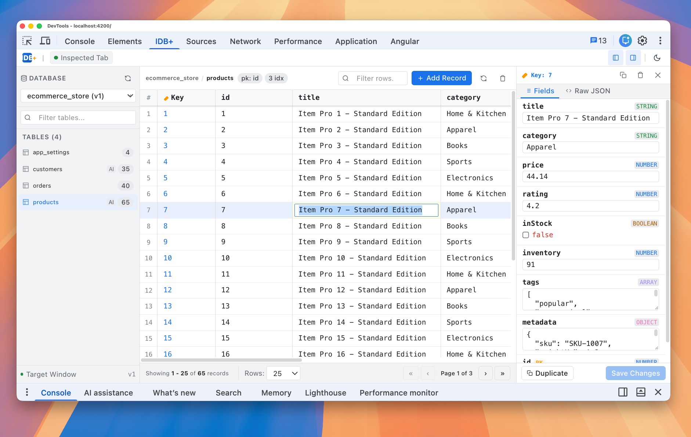
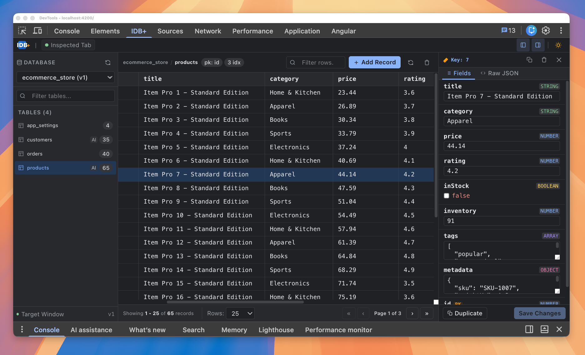

<p align="center">
  
</p>

<h1 align="center">IDB Plus</h1>

<p align="center">
  <strong>Desktop-grade IndexedDB GUI for Chrome DevTools. Fast spreadsheet grid, inline editing, instant search.</strong>
</p>

<p align="center">
  
  
  
  
</p>

<p align="center">
  
</p>

<p align="center">
  
</p>

---

## Why

Native DevTools IndexedDB is slow, read-only, clunky. No inline editing, no live search, painful JSON inspection.

**IDB Plus = TablePlus for your browser tab.**

| Native Chrome DevTools                | IDB Plus                                       |
| :------------------------------------ | :--------------------------------------------- |
| Read-only / console scripts to mutate | **Double-click inline editing** (type-safe)    |
| Clunky collapsed trees                | **Auto-detected spreadsheet columns**          |
| No search                             | **Real-time table & row filtering**            |
| Manual record creation                | **Auto schema templates & 1-click clone**      |
| Plain text view                       | **Fields visual editor + raw JSON beautifier** |
| Hard to debug locally                 | **Live tab bridge + offline sandbox mode**     |

---

## Features

- ⚡ **Spreadsheet Data Grid** — Auto columns from JSON keys. Pinned PKs, type badges (objects, arrays, bools).
- ✍️ **Inline Cell Edit** — Double-click edit. Preserves numbers, booleans, objects. `Enter` saves, `Esc` cancels.
- 🔍 **Live Search** — Instant filter across store names and row values.
- 🗂️ **Row Inspector** — Slide-out drawer. Form inputs per field + Raw JSON editor with validator/formatter.
- ➕ **CRUD & Clone** — 1-click duplicate record, add via pre-filled template, clear store, delete row.
- 🌓 **Theme Support** — Native DevTools dark & light modes.
- 🔒 **Private & Offline** — Zero telemetry, zero network calls. Pure browser APIs.

---

## Install

### Load Unpacked (Dev Mode)

```bash
git clone https://github.com/ahmad-moussawi/idb-plus.git
cd idb-plus
npm install
npm run build
```

1. Open `chrome://extensions`
2. Enable **Developer mode** (top right)
3. Click **Load unpacked** -> select `dist/idb-plus/browser`
4. Open DevTools (`F12`) -> select **IDB+** tab

---

## Local Dev

```bash
npm start     # Standalone sandbox @ http://localhost:4200
npm run watch # Auto-rebuild extension
npm test      # Vitest unit tests
npm run build # Production build
```

---

## Release Automation

The repository includes a GitHub Actions workflow at `.github/workflows/publish-chrome-extension.yml` that:

1. installs dependencies
2. builds the Angular app into `dist/idb-plus/browser`
3. packages the Chrome extension as a zip file
4. uploads the zip as a workflow artifact
5. publishes the zip to the Chrome Web Store

### Required GitHub Secrets

- `CHROME_EXTENSION_ID`
- `CHROME_EXTENSION_PUBLISHER_ID`
- `CHROME_EXTENSION_CLIENT_ID`
- `CHROME_EXTENSION_CLIENT_SECRET`
- `CHROME_EXTENSION_REFRESH_TOKEN`

### Triggers

- manually through **Actions > Publish Chrome extension**
- automatically when pushing a tag that starts with `v`

---

## Tech Stack

- **Angular 22** (Signals, Standalone)
- **Tailwind CSS v4**
- **TypeScript 5.9+**
- **Chrome MV3** (`chrome.devtools.panels`)

---

## License

MIT
